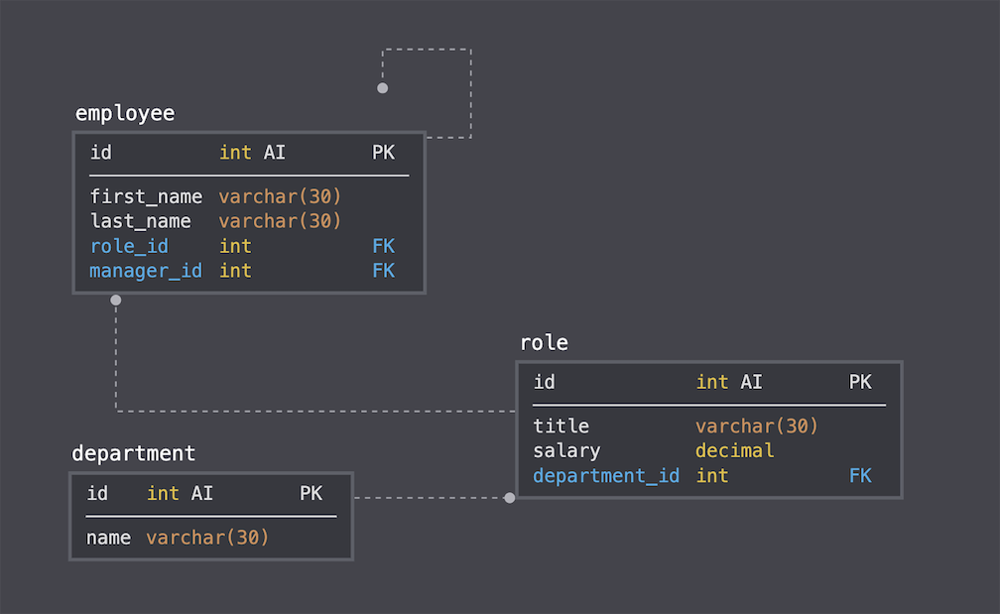

## employee-tracker

## Summary:

This simple command line application that allows the user to view and modify an employee database. 

Through a series of prompts the user is able to select from several options that include adding a new employee,
adding a new role, adding a new department, updating employee data. 

The user is provided options to view the employee data table, department data table, and the the role data table. 

## Installing:

Clone the repository to your local development environment.

git clone https://github.com/irjaimes/employee-tracker.git

Navigate to the employee-tracker folder using the command prompt.

Run npm install to install all dependencies. 

To run application run type: node index in your command line.

### Walk Through:

### Complete Video: [Here!](https://drive.google.com/file/d/1PehyXxkBBcXOXGrZNuNpCTPsScvG5IE5/view)

### Schema Implemented:

### Schema Description:

* Department
    * id: INT PRIMARY KEY
    * name: VARCHAR(30) to hold department name

* Role
    * id: INT PRIMARY KEY
    * title: VARCHAR(30) to hold role title
    * salary: DECIMAL to hold role salary
    * department_id: INT to hold reference to department role belongs

* Employee
    * id: INT PRIMARY KEY
    * first_name: VARCHAR(30) to hold employee first name
    * last_name: VARCHAR(30) to hold employee last name
    * role_id: INT to hold reference to employee role
    * manager_id: INT to hold reference to another employee that is manager of the current employee. This field may be null if the employee has no manager.

### Languages and Packages Used
* Javascript
* [mySQL2](https://www.npmjs.com/package/mysql2)
* [inquirer](https://www.npmjs.com/package//inquirer)
* [console.table](https://www.npmjs.com/package/console.table)
* [NodeJS](https://nodejs.org/api/fs.html)

### Author
Idzel Jaimes

### License
This project is licensed under the ISC License.